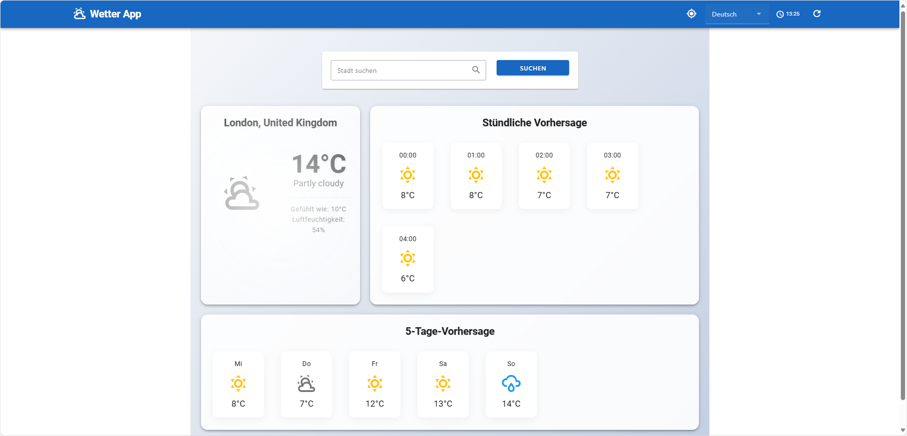

# Weather App

A modern, responsive weather application built with Vue.js and Vuetify that provides real-time weather information and forecasts.



## Features

- 🌍 Real-time weather data for any city worldwide
- 📱 Responsive design that works on all devices
- 🌈 Beautiful, dynamic UI with weather-based color themes
- 🔄 Auto-refresh functionality (every 5 minutes)
- 📍 Geolocation support with London as fallback
- 🌐 Multi-language support (6 languages)
- ⭐ Favorite cities management
- 📊 5-day weather forecast
- 🕒 Hourly weather updates
- 🌡️ Detailed weather information including:
  - Current temperature
  - Feels like temperature
  - Humidity
  - Weather description
  - Wind speed and direction
- 🎨 Dynamic weather-based UI elements:
  - Color themes that change based on weather conditions
  - Animated background effects
  - Hover animations on cards and buttons
  - Smooth transitions and loading states
- 🔍 Simple and intuitive city search:
  - Quick search with city name
  - Search button and Enter key support
  - Search icon for easy access

## Supported Languages

- English (British)
- German (Deutsch)
- Spanish (Español)
- Italian (Italiano)
- French (Français)
- Chinese (中文)

## Technologies Used

- Vue.js 3
- Vuetify 3
- Vue I18n for internationalization
- Local Storage for favorites and language preferences
- Material Design Icons

## Prerequisites

- Node.js (v14 or higher)
- npm or yarn

## Setup

1. Clone the repository:
   ```bash
   git clone [repository-url]
   cd weather-app
   ```

2. Install dependencies:
   ```bash
   npm install
   # or
   yarn install
   ```

3. Start the development server:
   ```bash
   npm run dev
   # or
   yarn dev
   ```

## Usage

1. Search for a city using the search bar:
   - Type a city name
   - Click the search button or press Enter
   - The weather data will be displayed immediately

2. View current weather conditions and forecasts:
   - Current temperature with weather icon
   - "Feels like" temperature
   - Humidity percentage
   - Weather description
   - City name and country code

3. Add cities to favorites:
   - Click the star icon to add/remove from favorites
   - Quick access to favorite cities
   - Persistent storage using localStorage

4. Switch between languages:
   - Use the language selector in the app bar
   - All UI elements will update immediately
   - Language preference is saved

5. Use the location button:
   - Get weather for your current location
   - Fallback to London if geolocation fails
   - 5-second timeout for location requests

6. Monitor auto-refresh:
   - View the countdown timer in the app bar
   - Data refreshes every 5 minutes
   - Manual refresh button available

## Features in Detail

### Weather Display
- Current temperature with weather icon
- "Feels like" temperature
- Humidity percentage
- Weather description
- City name and country code
- Dynamic weather icons that change based on conditions

### Forecast
- 5-day weather forecast
- Hourly weather updates
- Temperature predictions
- Weather condition icons
- Animated forecast cards with hover effects

### Favorites
- Add cities to favorites
- Quick access to favorite cities
- Persistent storage using localStorage
- Easy removal of favorites
- Interactive favorite chips with hover effects

### Internationalization
- Seamless language switching
- Persistent language preference
- Translated weather descriptions
- Localized date and time formats
- Language selector with smooth animations

### Geolocation
- Automatic location detection
- Fallback to London if geolocation fails
- Manual location refresh option
- Error handling for unsupported browsers
- 5-second timeout for location requests

### UI/UX Features
- Material Design icons throughout the interface
- Weather-based color themes
- Animated background with gradient effects
- Card hover animations
- Loading indicators
- Smooth transitions
- Responsive layout for all screen sizes

## Contributing

1. Fork the repository
2. Create your feature branch (`git checkout -b feature/AmazingFeature`)
3. Commit your changes (`git commit -m 'Add some AmazingFeature'`)
4. Push to the branch (`git push origin feature/AmazingFeature`)
5. Open a Pull Request

## License

This project is licensed under the MIT License - see the LICENSE file for details.

## Acknowledgments

- Vue.js team for the amazing framework
- Vuetify team for the material design components
- Material Design Icons for the beautiful icon set
- All contributors who have helped improve this project
